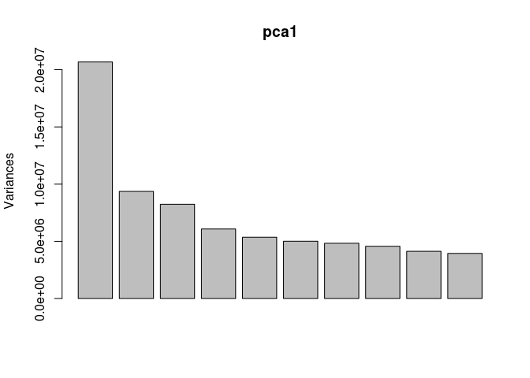
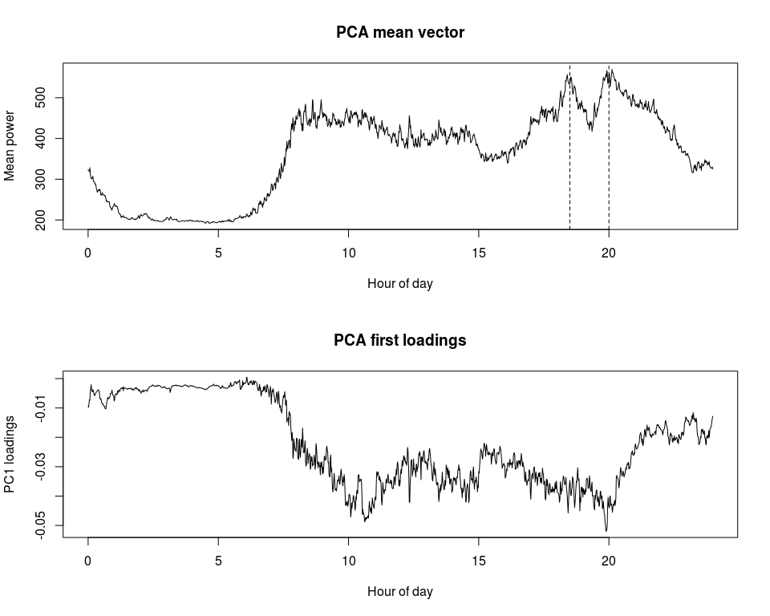
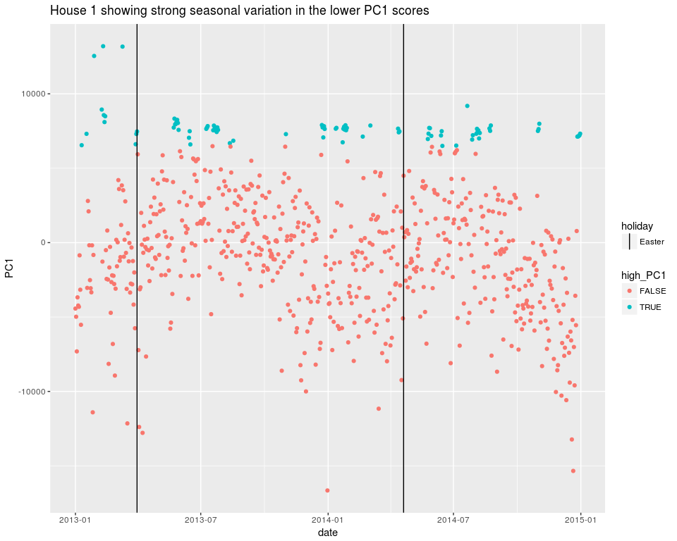
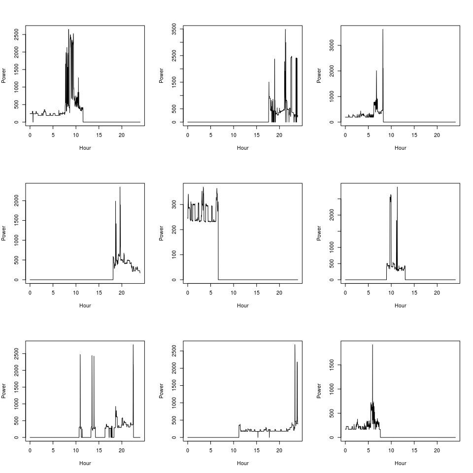
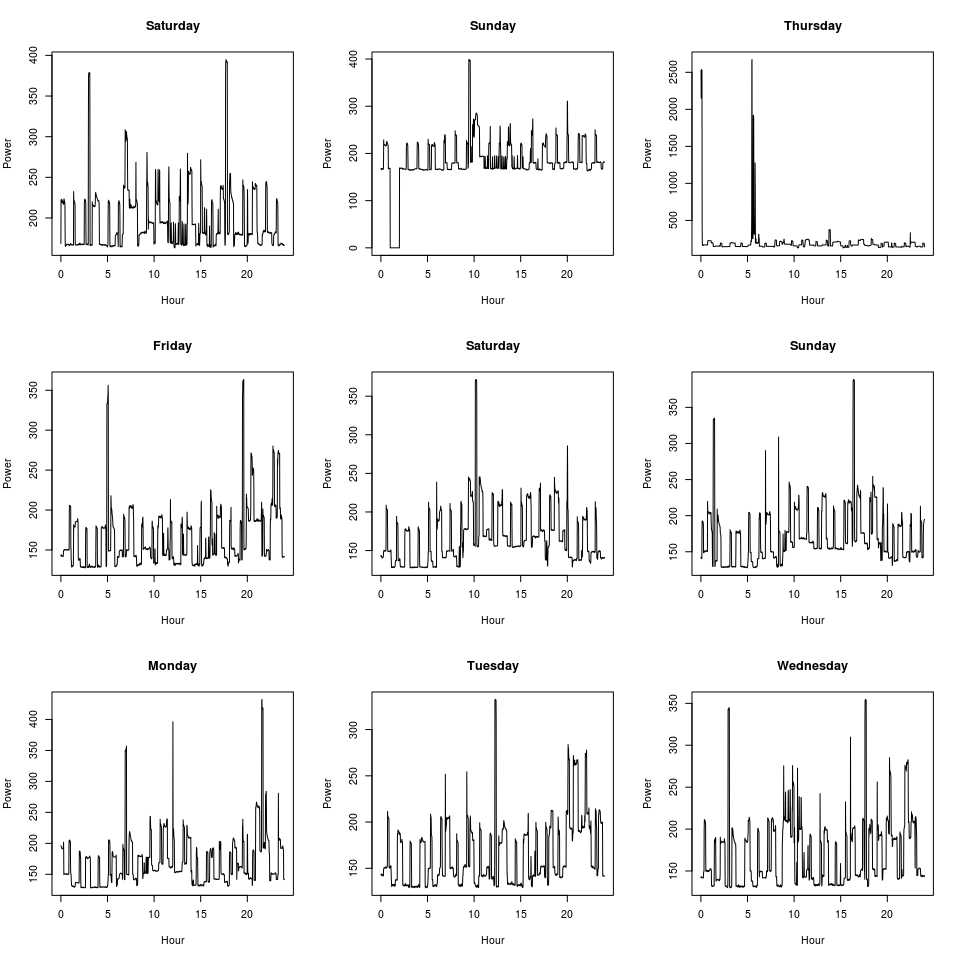

Introduction
============

Motivated by a recent [PhD
thesis](http://jack-kelly.com/files/writing/jack-kelly-phd-thesis.pdf),
high frequency electricity meter data readings provide a rich source of
insight into domestic consumption. This insight can benefit the consumer
through increased self-awareness, energy suppliers through improved
matching between usage and renewable cost/availability, and distributors
through improved network capacity and preparedness. By being more
self-aware of energy use in real-time, a consumer might think to turn
that immersion heater off. By better understanding the consumer diurnal
load profile, a supplier of renewable energy systems (or electricity)
might be able to find best matches with consumers. And by better
anticipating changes in load, a distributor might be able to power down
inefficient baseline (backup) generator for longer.

Questions
=========

Obvious questions that first come to mind that could be of interest are:

-   when is the peak load?
-   when is the minimum load?
-   when is the load most variable?
-   are there any obvious diurnal, weekly, seasonal patterns?

Data
====

The aforementioned source
[describes](http://data.ukedc.rl.ac.uk/simplebrowse/edc/efficiency/residential/EnergyConsumption/Domestic/UK-DALE-2015/ReadMe_DALE.html#Disaggregated)
some available
[data](http://data.ukedc.rl.ac.uk/simplebrowse/edc/efficiency/residential/EnergyConsumption/Domestic/UK-DALE-2015/UK-DALE-disaggregated).
The data originate from five households participating in a test
programme. A richer dataset than usually available from smart meters is
available because a greater granularity of labelled data is available
courtesy of additional meters linked to various power sockets. Here we
will only consider the 6 s aggregated data.

    library(tools)
    house1_file <- "Data/h1_ch1.dat"
    house1_url <- paste0("http://data.ukedc.rl.ac.uk/simplebrowse/edc/efficiency/",
                         "residential/EnergyConsumption/Domestic/UK-DALE-2015/",
                         "UK-DALE-disaggregated/house_1/channel_1.dat")
    house1_md5 <- "1e954b140917cb382dedc1e3847fa3ae"

    house2_file <- "Data/h2_ch1.dat"
    house2_url <- paste0("http://data.ukedc.rl.ac.uk/simplebrowse/edc/efficiency/",
                         "residential/EnergyConsumption/Domestic/UK-DALE-2015/",
                         "UK-DALE-disaggregated/house_2/channel_1.dat")
    house2_md5 <- "f779773b5d84261542a8d7c716300eb1"

    house3_file <- "Data/h3_ch1.dat"
    house3_url <- paste0("http://data.ukedc.rl.ac.uk/simplebrowse/edc/efficiency/",
                         "residential/EnergyConsumption/Domestic/UK-DALE-2015/",
                         "UK-DALE-disaggregated/house_3/channel_1.dat")
    house3_md5 <- "dd53383c38b1e0bca126576fb844057d"

    house4_file <- "Data/h4_ch1.dat"
    house4_url <- paste0("http://data.ukedc.rl.ac.uk/simplebrowse/edc/efficiency/",
                         "residential/EnergyConsumption/Domestic/UK-DALE-2015/",
                         "UK-DALE-disaggregated/house_4/channel_1.dat")
    house4_md5 <- "88e47be92f45b2f9d000fe44d8977236"

    house5_file <- "Data/h5_ch1.dat"
    house5_url <- paste0("http://data.ukedc.rl.ac.uk/simplebrowse/edc/efficiency/",
                         "residential/EnergyConsumption/Domestic/UK-DALE-2015/",
                         "UK-DALE-disaggregated/house_5/channel_1.dat")
    house5_md5 <- "424223412a7c702fc365ea9774247fe0"

    if (!dir.exists("Data")) {
        dir.create("Data")
    }

    if (!file.exists(house1_file)) {
        download.file(house1_url, house1_file)
    }

    if (!file.exists(house2_file)) {
        download.file(house2_url, house2_file)
    }

    if (!file.exists(house3_file)) {
        download.file(house3_url, house3_file)
    }

    if (!file.exists(house4_file)) {
        download.file(house4_url, house4_file)
    }

    if (!file.exists(house5_file)) {
        download.file(house5_url, house5_file)
    }

    # check md5
    check_md5 <- function(filename, md5) {
        if (md5sum(filename) != md5) {
            message(filename, " does not match expected md5sum")
        } else {
            message(filename, " matches expected md5sum: ", md5)
        }
    }

    check_md5(house1_file, house1_md5)

    ## Data/h1_ch1.dat matches expected md5sum: 1e954b140917cb382dedc1e3847fa3ae

    check_md5(house2_file, house2_md5)

    ## Data/h2_ch1.dat matches expected md5sum: f779773b5d84261542a8d7c716300eb1

    check_md5(house3_file, house3_md5)

    ## Data/h3_ch1.dat matches expected md5sum: dd53383c38b1e0bca126576fb844057d

    check_md5(house4_file, house4_md5)

    ## Data/h4_ch1.dat matches expected md5sum: 88e47be92f45b2f9d000fe44d8977236

    check_md5(house5_file, house5_md5)

    ## Data/h5_ch1.dat matches expected md5sum: 424223412a7c702fc365ea9774247fe0

House 1
-------

The data are in whitespace delimited files with Unix timestamp and power
measured.

    library(tidyverse)
    h1_data <- read_table(house1_file, col_names = F) %>%
        rename(timestamp = X1, power = X2) %>%
        mutate(timestamp = as.POSIXct(timestamp, origin = "1970/01/01"),
               weekday = weekdays(timestamp),
               time = format(timestamp, "%H:%M:%S"))

    ## Parsed with column specification:
    ## cols(
    ##   X1 = col_integer(),
    ##   X2 = col_integer()
    ## )

    h1_data %>% print

    ## # A tibble: 10,239,433 x 4
    ##              timestamp power weekday     time
    ##                 <dttm> <int>   <chr>    <chr>
    ##  1 2012-11-09 22:28:15   599  Friday 22:28:15
    ##  2 2012-11-09 22:28:21   582  Friday 22:28:21
    ##  3 2012-11-09 22:28:27   600  Friday 22:28:27
    ##  4 2012-11-09 22:28:33   586  Friday 22:28:33
    ##  5 2012-11-09 22:28:40   596  Friday 22:28:40
    ##  6 2012-11-09 22:28:52   581  Friday 22:28:52
    ##  7 2012-11-09 22:28:58   597  Friday 22:28:58
    ##  8 2012-11-09 22:29:04   592  Friday 22:29:04
    ##  9 2012-11-09 22:29:10   587  Friday 22:29:10
    ## 10 2012-11-09 22:29:16   574  Friday 22:29:16
    ## # ... with 10,239,423 more rows

    h1_data$timestamp %>% range

    ## [1] "2012-11-09 22:28:15 GMT" "2015-01-05 06:15:46 GMT"

The date range seems to be plausible, suggesting we're interpreting it
correctly.

The time series of the first 5000 rows is shown below.

    h1_data %>% 
        slice(1:5000) %>% 
        ggplot(aes(x = timestamp, y = power)) + 
        geom_line() +
        labs(title = "House 1 power over time, first 5000 samples")

This starts to give us a feel for the time series data from such a
system. We see an interesting initial downwards trend, but mostly the
features comprise periods of fairly level power consumption with step
changes and frequent small ticks. There are some prominent features of
relatively high demand.

### Maximum and minimum load

When was the maximum power load seen for house 1?

    h1_data %>% 
        select(timestamp, power) %>% 
        top_n(1, power)

    ## # A tibble: 1 x 2
    ##             timestamp power
    ##                <dttm> <int>
    ## 1 2014-05-16 08:13:39  8423

    h1_data %>% 
        select(timestamp, power) %>% 
        top_n(-1, power)

    ## # A tibble: 1 x 2
    ##             timestamp power
    ##                <dttm> <int>
    ## 1 2012-11-14 20:15:28    46

This max value and time of day is quite consistent with someone taking a
morning shower. The min value is non-negative, so sensible.

### Seasonal variation

Now we'll look at standardizing measurement times by reducing the
resolution down to the minutes level.

    # 2013 and 2014 are full years in data
    h1_data_std <- h1_data %>% 
        #slice(1:5000) %>% 
        filter(timestamp > "2013/01/01", timestamp < "2015/01/01") %>%
        select(timestamp, power) %>% 
        mutate(timestamp = format(timestamp, "%Y-%m-%d %H:%M")) %>% 
        group_by(timestamp) %>% 
        summarise(power_mean = mean(power)) %>% 
        fill(power_mean) %>% #cheap and quick
        mutate(weekday = weekdays(as.POSIXct(timestamp))) %>% 
        separate(timestamp, 
                 into = c("year", "month", "day", "hour", "minute"), 
                 convert = TRUE) %>%
        mutate(minutes = (hour * 60 + minute)) %>%
        select(year, month, day, weekday, minutes, power_mean) %>%
        spread(minutes, power_mean, fill = 0)

    vecs1 <- h1_data_std %>% 
        select(num_range("", 0:1439)) %>% 
        as.matrix()

    pca1 <- prcomp(vecs1)

    plot(pca1)

    h1_data_std_pca <- h1_data_std %>%
        select(year, month, day, weekday) %>%
        bind_cols(as_data_frame(pca1$x[, 1:3]))

    h1_data_std_pca %>% 
        ggplot(aes(x = PC1, y = PC2)) + 
        geom_point(alpha = 0.5) +
        geom_vline(xintercept = 6500)

There's a compact cluster at PC1 &gt; 6500, with wide scatter at lower
PC1 values. Can we find anything associated with this compact cluster?
The figure below shows the relevant PCA vectors. The top plot shows the
average diurnal power profile. The unsurprising low and quiescent night
usage is following by a ramping up in the morning. The daytime average
consumption stays reasonably high and spikey with a slight lull at about
3pm before climbing for the evening peak, which actually seems to
present as a couple of peaks around 6:30pm and 8pm (dashed vertical
lines). The compact cluster then is associated mostly with lower than
average daytime consumption.

    par(mfrow = c(2, 1))
    plot(x = (0:1439)/60, y = pca1$center, 
         type = "l", main = "PCA mean vector",
         xlab = "Hour of day", ylab = "Mean power")
    abline(v = 18.5, lty = 2)
    abline(v = 20, lty = 2)
    plot(x = (0:1439)/60, y = pca1$rotation[, 1], 
         type = "l", main = "PCA first loadings",
         xlab = "Hour of day", ylab = "PC1 loadings")

    h1_data_std_pca <- h1_data_std_pca %>%
        mutate(high_PC1 = PC1 > 6500)

Another way of looking at this PCA score is by date, as shown below. The
lower values of PC1 exhibit a clear seasonal variation, whereas the
higher score values do not. Given the interpretation from the loadings
that these higher PC1 scores are associated with lower than average
daytime power consumption, that this level is quite consistent, and that
they occur in some sort of discrete clumps, we might hypothesize that
this is associated with the house being vacant and with no human
activity superimposed on its base load.

    h1_data_std_pca %>% 
        unite(date, year, month, day, sep="/") %>% 
        mutate(date = as.Date(date)) %>% 
        ggplot() + 
        geom_point(aes(x = date, y = PC1, colour = high_PC1)) +
        labs(title = "House 1 showing strong seasonal variation in the lower PC1 scores") +
        geom_vline(data = data.frame(date = as.Date(c("2013/03/31", "2014/04/20")), holiday = "Easter"),
                   aes(xintercept = date, linetype = holiday))

We can pick out the diurnal power utilization profiles for these
proposed vacant days. Below we look at the first 9.

    vacant <- h1_data_std_pca$high_PC1
    x <- (0:1439)/60
    par(mfrow = c(3, 3))
    for (i in 1:9) {
        plot(x, vecs1[vacant, ][i, ], type = "l",
             xlab = "Hour", ylab = "Power")
    }

**Oh dear** This isn't what we were hoping for! It looks like these are
just bad days of data (recall when creating the standardized diurnal
profiles we filled any missing values with 0) rather than anything more
interesting. But our PCA loadings definitely suggested an interpretation
consistent with lower than average daytime values, and not just random
drop out. Let's persevere. Below we plot numbers 11 through 19. Now we
see just one brief drop-out, and one day with anomalous high power draw
over 2 kW, but apart from those, the profiles seem to show little to no
diurnal pattern. There are two with a curious slightly elevated range
from around 8 am to 8 pm of the order of a light bulb equivalent. It's
interesting that these are a Saturday and Sunday. Otherwise, we do
appear to have identified days where the only events occuring are the
baseline "heartbeat" of the house (e.g. refridgerator).

    vacant <- h1_data_std_pca$high_PC1
    weekday <- h1_data_std_pca$weekday[h1_data_std_pca$high_PC1]
    x <- (0:1439)/60
    par(mfrow = c(3, 3))
    for (i in 11:19) {
        plot(x, vecs1[vacant, ][i, ], type = "l",
             xlab = "Hour", ylab = "Power",
             main = weekday[i])
    }

Summary
=======

In this short note we have started to explore some high frequency (6 s
interval) electricity power consumption data from a house and
demonstrated that the application of PCA to standardized (to the minute)
diurnal power profiles can identify candidate periods of vacancy. These
then provide good opportunities for extracting (isolating) a relatively
few background features of appliances running in the house without
showers, toasters, kettles etc. randomly superposing themselves.

It is far from perfect. In the interest of quickly demonstrating a proof
of concept, a cluster of days was identified by application of a single
threshold on the first principal component. More sophisticated methods
would likely better isolate desired profiles.

Further work
============

As well as using such baseline, relatively consistent profiles to
identify the characteristics of some primary household signals that
could then be detected in more variable (messy) data, this approach
could also be of interest applied to multiple households to see if there
were any clusters of similar households.
